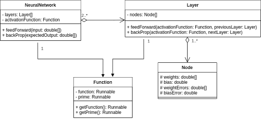

# APCSA Final Project

Aditya Anand (aanand50@stuy.edu)
Flint Mueller (fmueller50@stuy.edu)
Jason Chao (jchao50@stuy.edu)

## Functionalities

### Neural Network:
Users can pick random values from our MNIST dataset to input into the neural network, and the simulator will propagate this data through the network layers to produce an output, along with the percent certainty of each possible result. This output should accurately recognize and return the input.

### Editing Feature:
After obtaining the output, users can update the image with their mouse, changing the input. The refresh prediction button will prompt the program to provide another output, which should accurately reflect the changes that the user made.

### Visualization:
The simulator provides visual representations of the neural network’s architecture, including layers, nodes, and connections, as well as real-time updates during feedforward and backpropagation processes.

### How it Works:
The user interface is fairly self-explanatory, and all of the input will either be from buttons. 
There are options to change the neural network by drawing and editing the number.
There is a sidebar with options to randomize the input values for different numbers that the neural network can solve for.	

### Libraries:
No libraries are needed 

### UML Diagram:

### Log
Aditya coded the basic user interface to display our intended functionalities and outputs. He also researched and wrote the slideshow presentation and updated the Document Design Paper. Finally, he added the MNIST dataset used to test the programs.
Jason expanded the user interface to make the program display more details, such as the hidden layers and their connections. He added color coordination and arranged the on-screen elements to look visually appealing. Also worked on the UML diagram.
Flint added the main java code in relation to the Neural Network, such as the forward feeding and the backpropagation. Along with the processes that make the neural network run, he added the draw and update features. 
All three group members worked together in class, often utilizing a Driver-Navigator model when writing the code.

