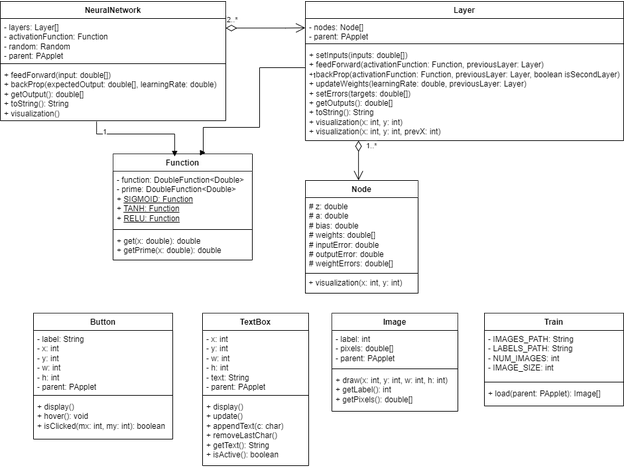

# APCSA Final Project

## Functionalities

### Feedforward Mechanism:
Users can input data into the neural network, and the simulator will propagate this data through the network layers to produce an output.

### Backpropagation Process:
After obtaining the output, users can provide the expected output to trigger the backpropagation process, adjusting the weights and biases in the network to minimize the error.

### Visualization:
The simulator provides visual representations of the neural network’s architecture, including layers, nodes, and connections, as well as real-time updates during feedforward and backpropagation processes.

### How it Works:
The user-interface will be fairly self-explanatory, and all of the input will either be from buttons or text-boxes. There will be options to change the neural network like adding nodes and layers, and changing the parameters, and each node’s weights and bias. There will also be a sidebar with options for each of the sample problems that the neural network can solve.	

### Libraries:
No libraries are needed 

### UML Diagram:

